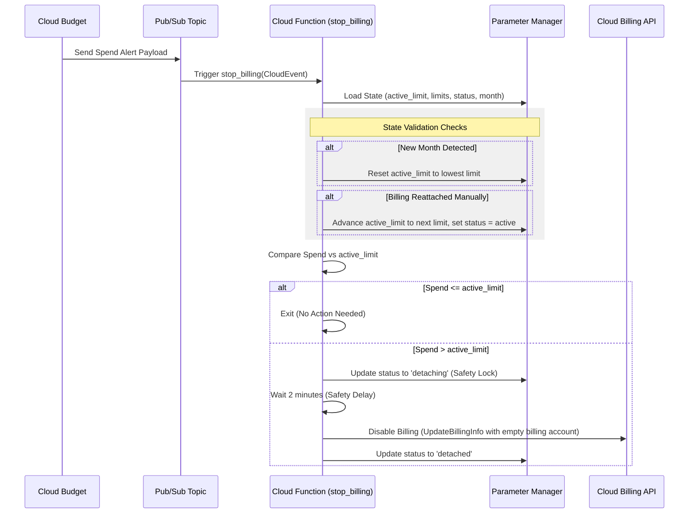

# Automatic Billing Disable Script

This repository contains a Terraform-managed project designed to automatically detach the billing account from a Google Cloud Project when specified monthly budget thresholds are exceeded. This prevents unexpected cost overruns by automatically disabling all billed services.

---

## 📝 How It Works (Detachment Flow)

The billing detachment workflow operates in an event-driven loop:



### Step-by-Step Mechanism:
1. **Trigger**: Google Cloud Billing Budgets monitor project spend and publish budget alert payloads to a Pub/Sub topic when threshold rules (e.g. 75%, 90%, 95%, 99%) are hit.
2. **Cloud Function Trigger**: The Pub/Sub message triggers the `stop_billing` Cloud Function (Gen 2).
3. **State Loading**: The function accesses the latest version of the state JSON from **Parameter Manager** (a global state parameter). This JSON contains:
   * `active_limit`: The current spend threshold allowed before detachment.
   * `limits`: All configured budget limit values.
   * `status`: Current status (`active`, `detaching`, or `detached`).
   * `month`: The billing month corresponding to the state.
4. **Monthly Reset**: If the function detects the current calendar month is newer than the state's `month`, it resets the `active_limit` back to the lowest budget limit and sets the status to `active`.
5. **Manual Reattachment Auto-Advance**: If the billing account was manually reattached in the GCP Console but a budget threshold alert fires, the function detects that billing is enabled, resets the status to `active`, and automatically advances the `active_limit` to the next configured budget limit threshold.
6. **100% Alert Warning**: If spend exceeds the `active_limit`, the function logs a warning. A **GCP Logging Metric** picks up this log, which triggers a **Monitoring Alert Policy** sending email notifications to all project owners and billing administrators.
7. **Safety Lock & Delay**: Before disabling billing, the function sets the Parameter Manager state to `detaching` (locking the state to prevent duplicate concurrent executions). It then sleeps for **2 minutes** as a cooldown/safety delay to allow any final logging or cleanups to complete.
8. **Detachment**: After the delay, the function checks if billing is still active. If yes, it calls the Google Cloud Billing API to set the project's `billingAccountName` to an empty string (`""`), disabling billing and stopping resources. The state is then set to `detached`.

---

## ✨ Features

* **Parameter Manager State Tracking**: Manages active limit thresholds, current state, and limits list globally.
* **Coexistence of Multiple Budgets**: Supports configuring multiple billing limits (USD/INR) with custom percentage threshold rules.
* **State Cooldown Lock**: Implements a concurrent execution lock (`detaching`) and a 2-minute safety delay before clearing the billing account.
* **Email & Chat Warning Alerts**: Integrates Google Chat Space Webhooks and SMTP direct email dispatch alongside GCP Cloud Monitoring alerts.
* **Auto Monthly Reset**: Automatically resets the active budget limit back to the lowest threshold at the start of a new month.
* **Manual Reattachment Detection**: Automatically advances active limits to the next step when project billing is manually restored.
* **Unified Deploy Script (`deploy.sh`)**: Boots GCP APIs, creates GCS backend bucket, runs `terraform validate`, runs `terraform apply`, and initializes Parameter Manager state in both interactive and non-interactive modes.

---

## 📂 Repository Contents

* **`deploy.sh`**: Unified bootstrap and deployment script.
* **`main.tf`**: Defines GCP infrastructure resources (Pub/Sub, Parameter Manager, Gen2 Function, logging metrics, alert policies, Secret Manager).
* **`variables.tf`**: Input variable declarations (budget configuration map, project ID, region, currency validation for `INR` and `USD`).
* **`backend.tf`**: Backend configuration block.
* **`update_budget_value.sh`**: Helper script to adjust budget thresholds and create new Parameter Manager versions.
* **`update_billing_state.sh`**: Helper script to inspect or reset Parameter Manager billing state.
* **`script/function_source/`**:
  * **`main.py`**: Cloud Function billing disable Python logic.
  * **`requirements.txt`**: Python package requirements.
* **`budgets.tfvars.json.example`**: Example template configuration file.

---

## 🚀 Getting Started

### **Prerequisites & Access Requirements**

To follow the **Principle of Least Privilege**, you do not need full `roles/owner` or `roles/editor` access to run the script. The deployment script supports validation against either full project admin roles OR a specific set of fine-grained permissions.

Your Google Cloud user identity must possess one of the following setups:

#### **Setup A: Administrator Access (Simplest)**
* **`roles/owner`** or **`roles/editor`** on the Google Cloud Project.

#### **Setup B: Least Privilege Access (Recommended)**
Instead of Owner/Editor, you can grant these specific, fine-grained roles:
1. **IAM Management**: `roles/resourcemanager.projectIamAdmin` (to configure Service Account bindings).
2. **API & Service Enablement**: `roles/serviceusage.serviceUsageAdmin` (to enable service APIs).
3. **Compute & SAs**: `roles/iam.serviceAccountAdmin` (to create the Cloud Function service account).
4. **Pub/Sub**: `roles/pubsub.admin` (to create topics and subscriptions).
5. **State Tracking**: `roles/parametermanager.admin` (to manage the Parameter Manager parameter state).
6. **Cloud Function**: `roles/cloudfunctions.developer` and `roles/run.admin` (to deploy the Gen2 function).
7. **Storage**: `roles/storage.admin` (to create and upload to the function archive bucket).
8. **Logging & Monitoring**: `roles/logging.admin` and `roles/monitoring.admin` (to create the warning logging metrics and alerts).
9. **Secrets**: `roles/secretmanager.admin` (to store notification credentials securely).
10. **Cloud Run Invocation**: `roles/run.admin` or `roles/resourcemanager.projectIamAdmin` (to allow the deployer to grant `roles/run.invoker` to the default Compute Engine Service Account).

#### **Required Billing Access (All Setups)**
* **`roles/billing.admin`** or **`roles/billing.user`** on the **Billing Account**: Required to configure budget thresholds.
* **`roles/billing.projectManager`** on the **Project**: Required to associate/unlink the billing account.

> [!IMPORTANT]
> **Trigger Permissions (`roles/run.invoker`)**: For Pub/Sub and Eventarc triggers to communicate with Cloud Functions (Gen2), the triggering agent (the default Compute Engine Service Account) requires `roles/run.invoker` access on the underlying Cloud Run service. The Terraform configuration in **`main.tf`** automatically configures this binding. The deployer only needs the admin role to assign it.

### **Authentication Setup**
Configure your local gcloud CLI context:
```bash
gcloud auth login
gcloud config set project "your-project-id"
```

---

## ⚙️ Configuration

### 1. Budgets Configuration (`budgets.tfvars.json`)
Copy the template configuration file:
```bash
cp budgets.tfvars.json.example budgets.tfvars.json
```

Edit `budgets.tfvars.json` with your project details:
```json
{
  "project_id": "your-gcp-project-id",
  "billing_account_id": "012345-6789AB-CDEF01",
  "currency": "USD",
  "budgets": {
    "budget_1": {
      "amount": 50,
      "thresholds": [0.75, 0.9, 0.95, 0.99]
    },
    "budget_2": {
      "amount": 100,
      "thresholds": [0.75, 0.9, 0.95, 0.99]
    }
  },
  "notification_emails": [
    "alerts@yourcompany.com",
    "devops@yourcompany.com"
  ],
  "default_sa_editor_mode": "keep"
}
```

### 2. Notifications & Credentials Configuration

#### A. Google Chat Alerts (Optional)
To receive alerts in a Google Chat Space:
1. Open your Google Chat Space > Click the space name > **Apps & integrations** > **Manage webhooks**.
2. Create a webhook and copy the incoming webhook URL.
3. Provide the URL via any of these methods:
   * **In `terraform.tfvars` or `variables.tf`** (around line 109):
     ```hcl
     google_chat_webhook_url = "https://chat.googleapis.com/v1/spaces/XXXXX/messages?key=YYYYY&token=ZZZZZ"
     ```
   * **Via environment variable before deploying**:
     ```bash
     export GOOGLE_CHAT_WEBHOOK_URL="https://chat.googleapis.com/v1/spaces/..."
     ```
   * **Directly in Secret Manager**: update the `google_chat_webhook_url` field in secret `do-not-delete-billing-notifications`.

#### B. Direct SMTP / Gmail Email Alerts (Optional)
To send email alerts directly via SMTP (e.g. Gmail / Google Workspace):
1. In your Google Account, enable **2-Step Verification** and generate a **16-character App Password** (under *Security > 2-Step Verification > App Passwords*).
2. Configure credentials using any of these methods:
   * **Interactive `./deploy.sh` (Recommended)**: You will be securely prompted for the App Password during script execution.
   * **In `terraform.tfvars` or `variables.tf`** (lines 115–150):
     ```hcl
     smtp_host         = "smtp.gmail.com"
     smtp_port         = 587
     smtp_username     = "your-email@company.com"
     smtp_sender_email = "your-email@company.com"
     smtp_key          = "xxxx xxxx xxxx xxxx" # 16-character App Password
     smtp_use_tls      = true
     ```
   * **Via environment variables before running `./deploy.sh`**:
     ```bash
     export SMTP_HOST="smtp.gmail.com"
     export SMTP_PORT="587"
     export SMTP_USERNAME="your-email@company.com"
     export SMTP_SENDER_EMAIL="your-email@company.com"
     ```
   * **Directly in Secret Manager**: update secret `do-not-delete-billing-notifications` with JSON:
     ```json
     {
       "google_chat_webhook_url": "...",
       "smtp_host": "smtp.gmail.com",
       "smtp_port": 587,
       "smtp_username": "your-email@company.com",
       "smtp_key": "your-16-char-app-password",
       "smtp_sender_email": "your-email@company.com",
       "smtp_use_tls": true
     }
     ```

---

## 🚀 Deployment

### **Option A: Interactive Deployment (Recommended)**
Run the script to be guided step-by-step:
```bash
chmod +x deploy.sh
./deploy.sh
```

### **Option B: Non-Interactive (Automated) Deployment**
Deploy instantly using arguments:
```bash
./deploy.sh -n -p "your-project-id" -b "012345-6789AB-CDEF01" -c "USD"
```

---

## 🔧 Managing Budgets & Billing State

* **Update Budget Values**: Run `./update_budget_value.sh` to update thresholds in Parameter Manager and sync Terraform.
* **Inspect or Reset Billing State**: Run `./update_billing_state.sh` to view current state versions or force-reset the status.

---

## 🔧 Rollback (Manual Re-enabling)

If the project billing account is automatically detached:

1. Log into the [Google Cloud Console](https://console.cloud.google.com/).
2. Navigate to **Billing** > **My Projects**.
3. Click the three dots next to the project and select **Change Billing**.
4. Link the target Billing Account and click **Set Account**.
5. Rerun `./deploy.sh` or `./update_billing_state.sh` to reset the Parameter Manager state to `active`.

---

## 🔄 Cleanup

To tear down all resources created by this project:
```bash
terraform destroy --auto-approve
```
